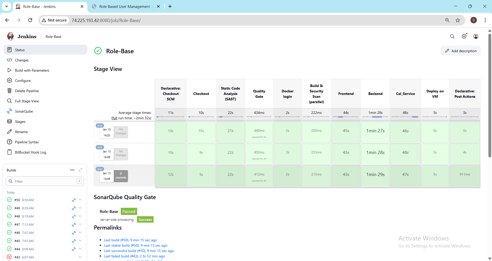

# Multi-Service Application with CI/CD Pipeline

This repository contains a complete CI/CD pipeline for building, pushing, and deploying a multi-service application.  
The system includes:

- **Backend** (API service)
- **Frontend** (React + Nginx)
- **Sia-Cal** (calculation service)
- **Database** (PostgreSQL)
- **Redis** (caching layer)
- **SonarQube** (Static Code Analysis & Quality Gate)
---

## 📌 Project Structure

```bash
├── backend/
│   ├── Dockerfile
│   ├── .dockerignore
│   └── src/...
├── sia_cal/
│   ├── Dockerfile
│   ├── .dockerignore
│   └── src/...
├── frontend/
│   ├── Dockerfile
│   ├── .dockerignore
│   ├── nginx.conf
│   └── src/...
├── docker-compose.yml  # For application services
├── sonar-compose.yml   # SonarQube + PostgreSQL
├── Jenkinsfile
├── README.md
```

📌 Used caching layer for Redis

---

## 🚀 CI/CD Workflow

1. **Code Push**  
   Developers push code to the repository.

2. **Webhook Trigger**  
   A webhook notifies Jenkins of the new commit.

3. **Jenkins Pipeline Execution** 
   - Static code analysis using SonarQube 
   - Quality Gate enforcement (pipeline fails if not passed)
   - Builds Docker images for each service (Frontend, Backend, Cal_Service)
   - **Trivy** scans built images for High/Critical OS-level vulnerabilities.
   - Target VM pulls updated images and restarts services via `docker-compose`
   - Tags and pushes images to Docker Hub.

4. **Deployment on VM**  
   - Target VM pulls the latest images.  
   - Services are restarted using `docker-compose`.

---

## 🐳 Docker & Deployment

- Each service has its own `Dockerfile` and `.dockerignore`.
- Images are pushed to **Docker Hub** under the project namespace.
- Deployment is managed via `docker-compose.yml`.

### Run Locally

```bash
# Build and run all services
docker-compose up --build

# Start SonarQube
docker compose -f sonar-compose.yml up -d

# Stop services
docker-compose down
```

---

## 📌 Jenkins pipeline dashboard



## 📌 Jenkins pipeline dashboard


